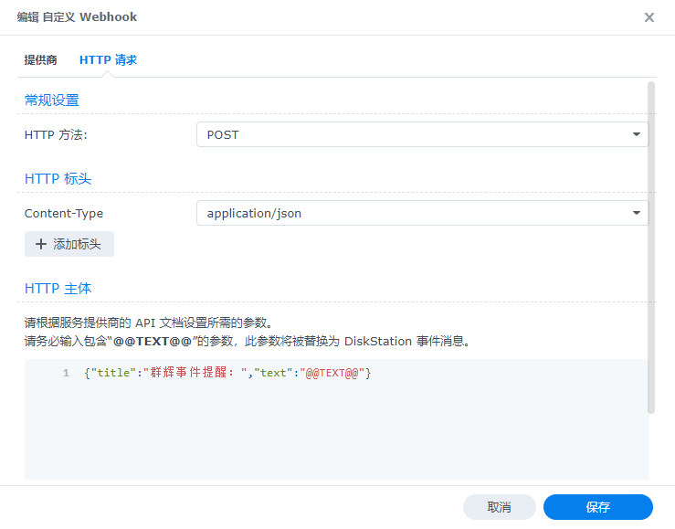
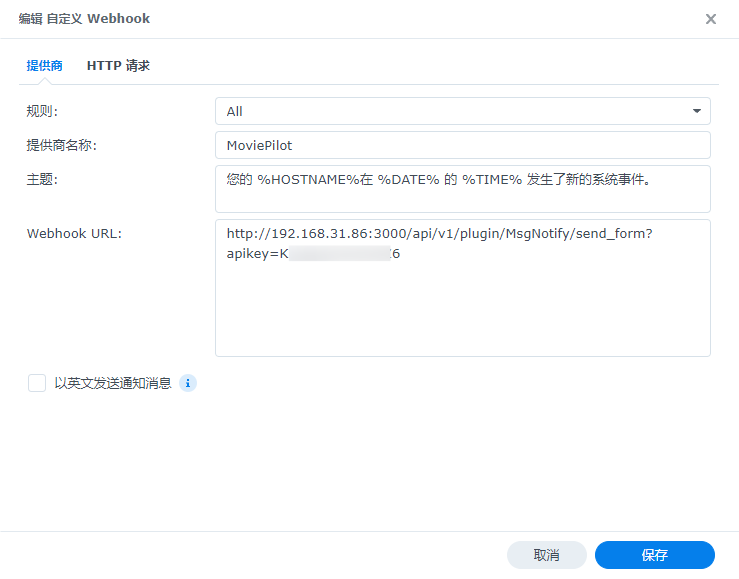
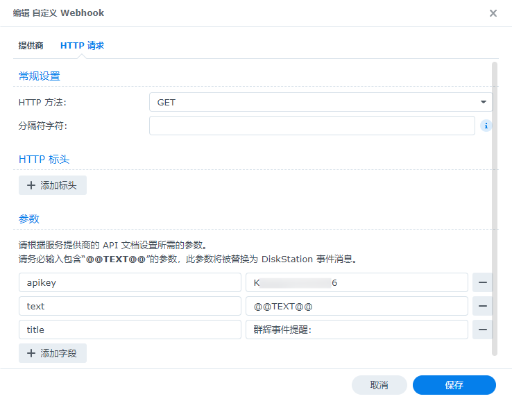
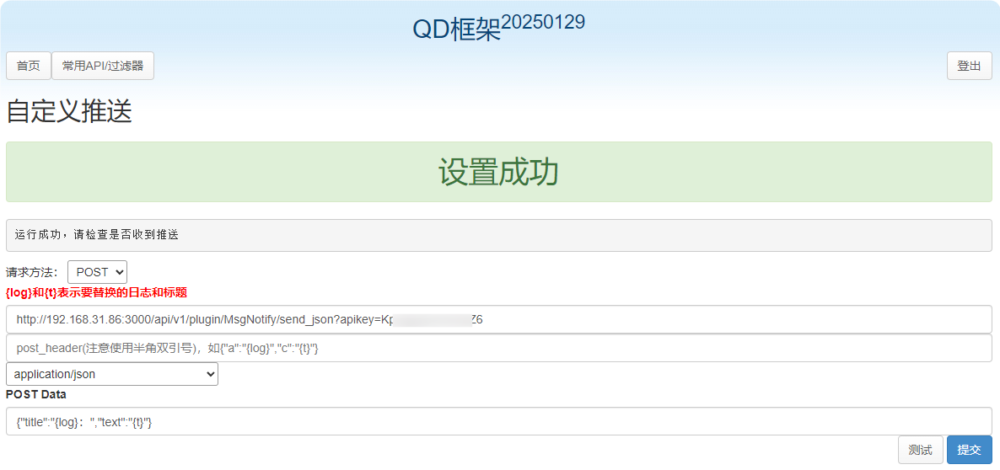
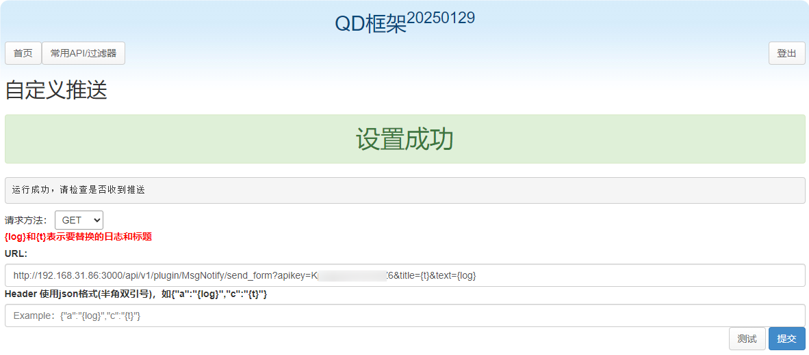
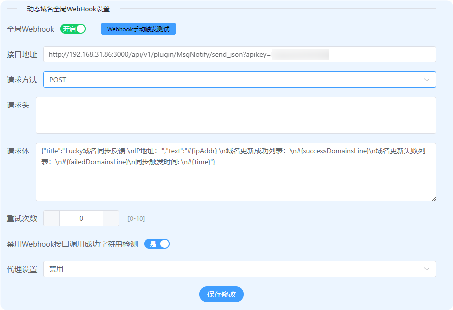
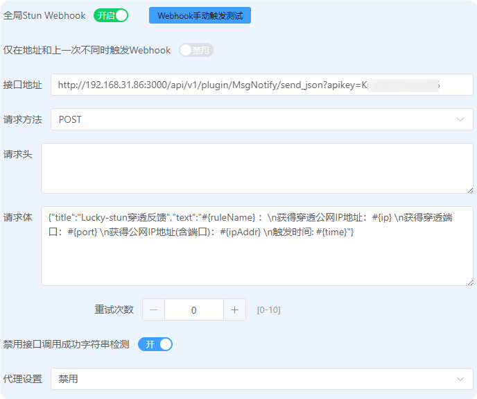
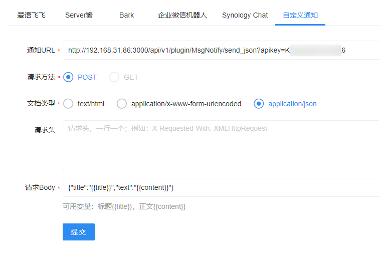
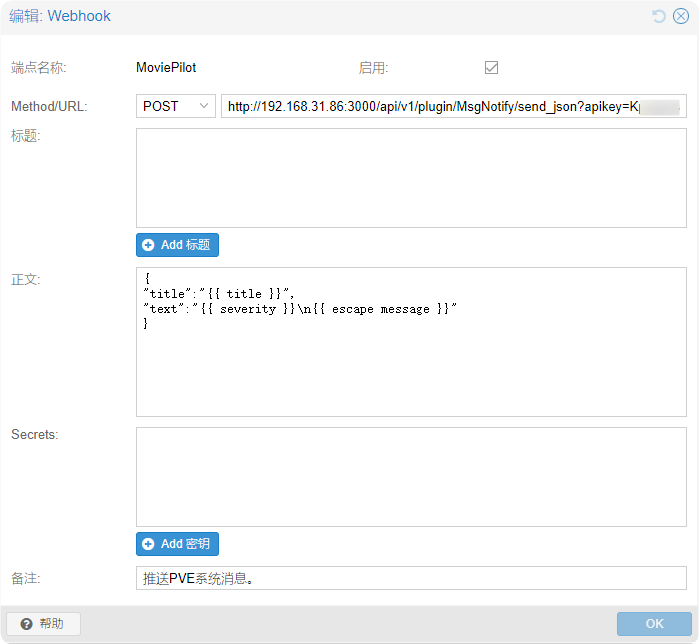
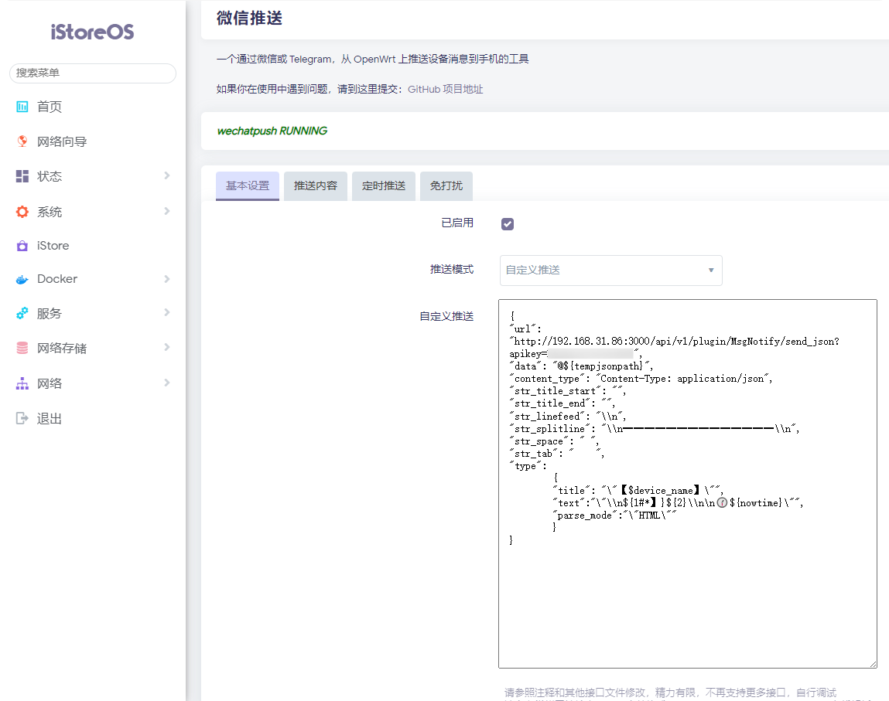

# 外部消息转发使用说明

## 目录
- [1. 群辉事件提醒](#1-群辉事件提醒)
- [2. QD框架自定义消息](#2-qd框架自定义消息)
- [3. Lucky 动态域名全局WebHook设置](#3-lucky-动态域名全局webhook设置)
  - [3.1. Lucky 全局Stun Webhook设置](#31-lucky-全局stun-webhook设置)
- [4. IYUUPlus开发版](#4-iyuuplus开发版)
- [5. Proxmox Virtual Environment](#5-proxmox-virtual-environment)
- [6. iStoreOS微信推送](#6-istoreos微信推送)

---

## 使用说明
本文档提供了各种系统与MoviePilot的消息转发集成方案。每个示例都包含了完整的API调用方式和配置说明。

### 通用说明
- 所有API调用都需要提供正确的`apikey`
- 请将示例中的`moviepilot_ip:port`替换为您的实际服务地址
- 部分示例支持GET和POST两种调用方式
- 建议使用POST方式,支持更复杂的消息格式

---

## 1. 群辉事件提醒

### API地址
- POST: `http://moviepilot_ip:port/api/v1/plugin/MsgNotify/send_json?apikey=api_token`
- GET: `http://moviepilot_ip:port/api/v1/plugin/MsgNotify/send_form?apikey=api_token`

### 请求格式
#### POST方式
```json
{
    "title": "群辉事件提醒：",
    "text": "@@TEXT@@"
}
```

#### GET方式
- 参数：`title=群辉事件提醒：&text=@@TEXT@@`

### 设置参考
#### POST方式设置
- 在群晖通知设置中配置Webhook
- 
- 填写API地址和请求体
- 

#### GET方式设置
- 在群晖通知设置中配置Webhook
- 
- 填写API地址和参数
- 

---

## 2. QD框架自定义消息

### API地址
- POST: `http://moviepilot_ip:port/api/v1/plugin/MsgNotify/send_json?apikey=api_token`
- GET: `http://moviepilot_ip:port/api/v1/plugin/MsgNotify/send_form?apikey=api_token&title={log}&text={t}`

### 请求格式
#### POST方式
```json
{
    "title": "{log}：",
    "text": "{t}"
}
```

### 设置参考
#### POST方式设置
- 在QD框架中配置Webhook
- 

#### GET方式设置
- 在QD框架中配置Webhook
- 

---

## 3. Lucky 动态域名全局WebHook设置

### API地址
- POST: `http://moviepilot_ip:port/api/v1/plugin/MsgNotify/send_json?apikey=api_token`

### 请求格式
```json
{
    "title": "Lucky域名同步反馈",
    "text": "IP地址：\n#{ipAddr} \n域名更新成功列表：\n#{successDomainsLine}\n域名更新失败列表：\n#{failedDomainsLine}\n同步触发时间: \n#{time}"
}
```

### 设置参考
- 在Lucky动态域名设置中配置Webhook
- 

---

## 3.1. Lucky 全局Stun Webhook设置

### API地址
- POST: `http://moviepilot_ip:port/api/v1/plugin/MsgNotify/send_json?apikey=api_token`

### 请求格式
```json
{
    "title": "Lucky-stun穿透反馈",
    "text": "#{ruleName} ：\n获得穿透公网IP地址：#{ip} \n获得穿透端口：#{port} \n获得公网IP地址(含端口)：#{ipAddr} \n触发时间: #{time}"
}
```

### 设置参考
- 在Lucky Stun设置中配置Webhook
- 

---

## 4. IYUUPlus开发版

### API地址
- POST: `http://moviepilot_ip:port/api/v1/plugin/MsgNotify/send_json?apikey=api_token`

### 请求格式
```json
{
    "title": "{{title}}",
    "text": "{{content}}"
}
```

### 设置参考
- 在IYUUPlus中配置Webhook
- 

---

## 5. Proxmox Virtual Environment

### 版本要求
- 需要PVE 8.3.1及以上版本才支持Webhook功能
- 参考文档: [PVE Webhook文档](https://you-domain/pve-docs/chapter-notifications.html#notification_targets_webhook)

### 升级步骤
```bash
# 查询PVE版本
pveversion

# 升级到最新版本
apt update && apt upgrade -y

# 执行完整升级（可选）
apt dist-upgrade -y

# 清理旧包
apt autoremove

# 验证版本
pveversion
```

### API地址
- POST: `http://moviepilot_ip:port/api/v1/plugin/MsgNotify/send_json?apikey=api_token`

### 请求格式
```json
{
    "title": "{{ title }}",
    "text": "{{ severity }}\n{{ escape message }}"
}
```

### 设置参考
- 在PVE通知设置中配置Webhook
- 

---

## 6. iStoreOS/OpenWrt微信推送

### 插件信息
基于 [luci-app-wechatpush](https://github.com/tty228/luci-app-wechatpush) 插件的自定义推送配置

### API地址
- POST: `http://moviepilot_ip:port/api/v1/plugin/MsgNotify/send_json?apikey=api_token`

### 自定义推送配置
```json
{
    "url": "http://192.168.31.86:3000/api/v1/plugin/MsgNotify/send_json?apikey=api_token",
    "data": "@${tempjsonpath}",
    "content_type": "Content-Type: application/json",
    "str_title_start": "",
    "str_title_end": "",
    "str_linefeed": "\\n",
    "str_splitline": "\\n━━━━━━━━━━━━━━\\n",
    "str_space": " ",
    "str_tab": "    ",
    "type": {
        "title": "\"【$device_name】\"",
        "text": "\"\\n${1#*】}${2}\\n\n🕜️${nowtime}\"",
        "parse_mode": "\"HTML\""
    }
}
```

### 设置参考
- 在luci-app-wechatpush插件中配置自定义推送
- 

---

## 注意事项
1. 所有API调用都需要正确的API密钥
2. 请确保服务器地址和端口配置正确
3. 建议使用POST方式发送消息
4. 部分示例支持GET方式,但功能可能受限
5. 请根据实际需求修改消息模板
